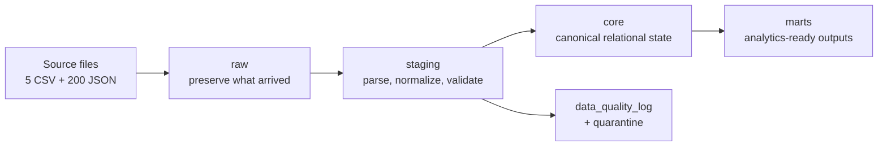
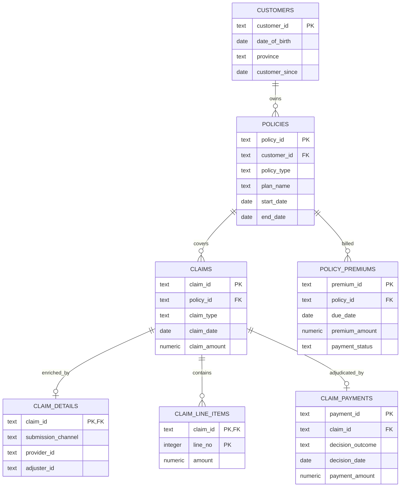

# Database Model

*GMS Data Engineer Case Study. Database model for the frozen synthetic source dataset defined by `docs/project_overview.md`, `docs/source_data_dictionary.md`, `docs/source_data_dictionary.yaml`, and `docs/generator_specification.md`.*

## 1. Purpose and scope

This document defines the PostgreSQL database architecture used after synthetic source generation. The generated source model is frozen and is not redesigned here.

The implementation target is **Supabase-hosted PostgreSQL**, while the SQL remains portable to standard PostgreSQL and avoids unnecessary Supabase-specific features.

The database uses four schemas:

| Schema | Purpose |
|---|---|
| `raw` | Immutable database copy of source arrivals, preserving source values and malformed input where possible. |
| `staging` | Per-source parsing, normalization, deduplication, validation, JSON flattening, and data-quality classification. |
| `core` | Canonical integrated relational model with source-of-truth rules and referential integrity applied. |
| `marts` | Objective-specific analytical outputs. The schema is created now; the five marts are implemented later. |

The design supports the assessment's current one-time batch and also repeated future batch ingestion without recreating the database.

## 2. Architecture



A useful distinction is:

- **raw = history of source arrivals**
- **core = current canonical business state**

For a later batch, the same database and tables are reused. New source rows are appended to `raw`, transformed through `staging`, and inserted/updated in `core`. The DDL is not rerun for every ingestion.

## 3. Repeatable ingestion and lineage

### 3.1 Ingestion runs

`raw.ingestion_runs` records one logical source batch. A deterministic `batch_fingerprint` allows the pipeline to recognize a previously processed batch and supports idempotent reruns.

### 3.2 Source files

`raw.source_files` records each physical CSV or JSON file in a batch, including SHA-256, size, path, and record count when available.

This gives traceability such as:

```text
load 1 -> Claim.csv
load 1 -> json/H00001.json
load 2 -> Claim.csv
...
```

### 3.3 Long-running behavior

For recurring ingestion:

```text
new source batch
      |
      v
append to raw
      |
      v
clean current load in staging
      |
      v
insert/update canonical core state
      |
      v
refresh analytical marts
```

Raw remains append-oriented. Core is state-oriented. Historical slowly-changing core tables are deliberately out of scope for this assessment.

## 4. Raw schema

### 4.1 Design rules

Raw tables are intentionally permissive.

- CSV business columns are stored as `text`.
- Source business identifiers are **not** database primary keys in raw.
- Raw tables do not enforce business foreign keys or domain constraints.
- Exact and near duplicates must be loadable.
- Invalid foreign keys must be loadable.
- Original file and row lineage is retained.

This prevents the database from rejecting the defects that the pipeline is expected to detect.

### 4.2 Raw tables

| Table | Grain | Purpose |
|---|---|---|
| `raw.ingestion_runs` | one source batch / pipeline load | Batch lineage and idempotency metadata. |
| `raw.source_files` | one physical input file | File-level lineage, checksum and source metadata. |
| `raw.customer_csv` | one physical Customer.csv row | Raw customer extract. |
| `raw.policy_csv` | one physical Policy.csv row | Raw policy extract. |
| `raw.claim_csv` | one physical Claim.csv row | Raw claim header extract, including duplicates. |
| `raw.claim_payment_csv` | one physical Claim_Payment.csv row | Raw adjudication/payment extract. |
| `raw.policy_premium_csv` | one physical Policy_Premium.csv row | Raw premium instalment extract. |
| `raw.claim_detail_files` | one physical JSON file | Exact JSON text plus JSONB when parsing succeeds. |

### 4.3 JSON storage

The raw JSON layer stores both:

- `raw_text text`: the original file contents;
- `payload_jsonb jsonb`: parsed representation when the JSON is valid.

Malformed JSON cannot be represented as PostgreSQL `jsonb`, so malformed files keep `payload_jsonb = null` and preserve their original text and parse error.

This is intentional: JSONB is queryable but does not preserve original whitespace/key order, while `raw_text` preserves the source representation.

## 5. Staging schema

Staging answers: **what does each source record mean after parsing and normalization?**

It does not yet answer: **what is the final trusted business record?**

Staging therefore uses typed columns but remains permissive enough to hold recoverable errors and cross-source conflicts.

Common lineage/status fields include:

- `load_id`
- source raw row/file identifier
- `record_status`
- `dq_issue_count`

The allowed staging record statuses are:

- `candidate`
- `accepted`
- `duplicate`
- `rejected`

### 5.1 Staging source tables

| Table | Grain | Main work |
|---|---|---|
| `staging.customers` | one raw customer row | Dates, names, gender, province, postal code, phone and email normalization. |
| `staging.policies` | one raw policy row | ID/category/date/money normalization and policy validation. |
| `staging.claims` | one raw claim row | Key/category/date/amount normalization and duplicate detection. |
| `staging.claim_payments` | one raw payment row | Adjudication/payment parsing and date/status checks. |
| `staging.policy_premiums` | one raw premium row | Premium parsing and derived-status checks. |

Cross-source FKs are not enforced here because detecting broken relationships is part of staging/core reconciliation.

## 6. JSON flattening

The frozen project design requires the claim-detail JSON to be flattened into two relational tables.

### 6.1 `staging.claim_details`

Grain: one successfully parsed JSON file.

It contains the common claim-detail envelope plus flattened health, dental, and travel-specific fields.

Important common fields:

- claim identity and product line
- submission channel/timestamp
- provider ID/name/type
- adjuster ID/notes
- submitted documents

Health fields include practitioner and prescription attributes. Dental stores claim category. Travel stores trip dates, destination, incident details, currency, exchange rate and incident sub-limit.

Recoverable schema drift such as legacy keys, number-as-string fields, scalar-vs-array line items and document strings is normalized before these columns are populated.

### 6.2 `staging.claim_line_items`

Grain: one normalized JSON line item.

Common fields include:

- `claim_id`
- `line_no`
- `service_date`
- description
- quantity
- unit amount
- amount

Dental-only fields are nullable:

- procedure code
- procedure category
- tooth number

A source-array index is retained for lineage even before business `line_no` is trusted.

## 7. Duplicate-customer resolution

The source deliberately contains the same person under multiple customer IDs.

`staging.customer_identity_map` records deterministic survivor mapping instead of silently deleting aliases.

The frozen matching rule is exact equality after normalization of:

- first name
- last name
- date of birth
- postal code

Survivorship prefers the most complete record, then the most recent `last_updated`.

Example:

```text
source_customer_id  canonical_customer_id  resolution_type
C00034              C00034                 survivor
C00154              C00034                 duplicate_alias
```

Policies attached to an alias are re-keyed to the canonical customer when core is built.

## 8. Data-quality logging and quarantine

### 8.1 `staging.data_quality_log`

Grain: one detected issue/action.

It records:

- source and raw record
- business key
- rule ID
- affected field
- severity
- action
- original and cleaned values
- optional JSON details
- detection timestamp

Severity values:

- `info`
- `warning`
- `error`

Action values:

- `normalized`
- `repaired`
- `deduplicated`
- `flagged`
- `quarantined`
- `excluded`

The pipeline must derive this table from the actual raw sources. It must never use `data/raw/_defect_log.csv` as an input.

### 8.2 `staging.quarantine`

Grain: one record/file rejected from core for one blocking reason.

Quarantine references the raw record rather than copying the complete source payload again.

Examples:

- malformed JSON: quarantine the JSON file, not the corresponding claim;
- orphan JSON: quarantine the JSON file;
- missing JSON: keep the claim and log the missing detail;
- claim whose policy cannot be resolved: block the claim from core;
- recoverable formatting problem: normalize and keep the record.

The general rule is **repair where deterministic, quarantine only when a trustworthy relational record cannot be formed**.

## 9. Core schema

Core answers: **what does the pipeline trust as the canonical business state?**

### 9.1 Core ERD



### 9.2 `core.customers`

Grain: one canonical customer/person.

Direct identifiers remain in core but are excluded from analytical marts.

`date_of_birth` is nullable in core because an unrecoverable DOB problem should not automatically destroy the customer's policies and claims. Age-dependent analytics can handle unknown age separately.

`province` is authoritative for region.

### 9.3 `core.policies`

Grain: one policy.

`customer_id` is an enforced FK to `core.customers`.

`plan_name` and `sales_channel` are nullable because the source contains deliberately missing values that may not always be deterministically recoverable. A policy with one unknown descriptive attribute can still be structurally valid.

### 9.4 `core.claims`

Grain: one canonical claim header.

The core table intentionally does **not** carry the source copies:

- `Claim.customer_id`
- `Claim.region`
- `Claim.claim_status`

Instead:

- customer is obtained through policy;
- region is obtained from the canonical customer;
- status is obtained from the authoritative payment/adjudication row, with no row meaning pending.

This prevents downstream users from accidentally consuming a known non-authoritative copy.

`service_date` and `claim_amount` may be null only when an invalid source value cannot be safely reconstructed. Deterministic repairs from JSON are logged.

### 9.5 `core.claim_payments`

Grain: at most one adjudication/payment lifecycle row per claim.

`claim_id` is unique because appeals and re-openings are out of scope.

When one operational date is corrupt and cannot be recovered, the date can remain null instead of dropping an otherwise valid decision row and falsely making the claim appear pending.

### 9.6 `core.policy_premiums`

Grain: one premium instalment.

The source `customer_id` copy is discarded after reconciliation. Ownership comes from the policy FK.

### 9.7 `core.claim_details`

Grain: zero or one usable JSON detail record per claim.

A claim may legitimately have no detail row because its JSON is missing, malformed, or unusable.

For `documents_submitted`:

- empty array = source explicitly reports no documents;
- null = document information is unknown/unrecoverable.

This distinction is important for fraud-feature engineering.

### 9.8 `core.claim_line_items`

Grain: one line item within one claim.

Primary key: `(claim_id, line_no)`.

The database checks individual line-item arithmetic, but does **not** require the aggregate line-item total to equal the claim header amount because the frozen F6 suspicious pattern intentionally creates legitimate header/detail mismatches.

## 10. Source-of-truth and reconciliation

| Fact | Authoritative source | Core treatment |
|---|---|---|
| Customer identity/attributes | `Customer.csv` | Deterministic duplicate-person merge. |
| Policy owner | `Policy.csv.customer_id` | Claim/premium customer copies are checked, then discarded from core. |
| Region | `Customer.csv.province` | Claim region copy is checked, then discarded from core. |
| Claim existence | `Claim.csv` | Orphan JSON cannot create a core claim. |
| Claim amount | valid `Claim.csv.claim_amount` | JSON is reconciliation evidence; disagreement is flagged, not automatically overwritten. |
| Claim decision/status | `Claim_Payment.csv` | Decision outcome wins; absence of a payment row means pending. |
| Payment amount | `Claim_Payment.csv.payment_amount` | Retained separately; mismatch with approved amount is flagged. |
| Premium ownership | `Policy.csv.customer_id` | Premium customer copy is checked, then discarded. |
| Claim detail | JSON | Enriches an existing claim only. |

### 10.1 Repair rule

Authoritative does not mean blindly accepting a demonstrably corrupt value.

Examples:

- valid positive claim header amount disagrees with JSON: keep header amount and flag mismatch because it may be F6;
- header claim amount is missing/negative/clearly corrupt and JSON provides an unambiguous valid reconstruction: repair and log;
- missing/invalid service date with reliable line-item dates: repair from minimum line-item date and log.

This avoids cleaning away suspicious business signals.

## 11. Important constraints and nullability

The DDL deliberately uses PostgreSQL `text + check` rather than custom enum types. This keeps schema changes easier and remains portable.

Examples of enforced core constraints:

- ID patterns for canonical business IDs;
- served province domain;
- valid product/coverage/status domains;
- non-negative/positive money rules;
- policy end date not before start date;
- claim service date not after claim submission date;
- premium paid/late/missed status consistency;
- denied claim payment mechanics;
- line-item quantity and amount positivity.

Cross-table business rules that require multiple records or aggregation are enforced by transformation/validation SQL rather than complex triggers.

## 12. Index strategy

The dataset is small, so indexing is intentionally modest.

Additional indexes:

| Index | Reason |
|---|---|
| `core.policies(customer_id)` | Customer-to-policy joins. |
| `core.claims(policy_id, claim_date)` | Policy claim history and time-window filtering. |
| `core.policy_premiums(policy_id, due_date)` | Premium history, retention windows and exposure calculations. |
| `core.claim_details(provider_id)` | Provider-concentration fraud features. |
| `core.claim_details(adjuster_id)` | Operational-efficiency analysis. |

No extra index is required for `core.claim_payments.claim_id` because its unique constraint creates one.

No extra index is required on `core.claim_line_items.claim_id` because the composite primary key begins with `claim_id`.

No JSONB GIN index is created because JSON is flattened once and arbitrary raw-JSON search is not the analytical workload.

No partitioning is justified at the assessment scale.

## 13. Support for the five analytics objectives

| Objective | Core support |
|---|---|
| Fraud detection | Claims + policies + details + line items + payments: early claim, waiting period, near maximum, repeat claims, provider concentration, line-item reconciliation, documents, submission timing and travel-date features. |
| Customer retention | Customers + policies + premiums + claims/payments: tenure, late/missed premiums, denied claims, age-band changes and snapshot-active health/dental policies. |
| Operational efficiency | Claims + payments + details: submission, processing start, decision and payment dates; submission channel, adjuster, product and document completeness. |
| Region-wise insights | Claims -> policies -> customers: authoritative customer province, product line, claim type, date and amounts. |
| Policy optimization | Policies + premiums + claims/payments + generalized demographics: exposure-aligned premium due and approved claims by plan/age band/coverage/province. |

The retention mart will use the frozen snapshot and observation/outcome windows, avoiding extract-end status leakage.

The policy output will use the documented approved-claims-to-premium-due performance ratio over aligned exposure periods and will not be described as a formal actuarial loss ratio.

## 14. Marts

The `marts` schema is created in the initial DDL, but mart tables are intentionally deferred until their exact analytical output columns are implemented.

Planned grains remain:

| Mart | Grain |
|---|---|
| Fraud | one row per claim |
| Retention | one eligible customer at snapshot |
| Operations | one row per claim |
| Region | province x product line x claim type x quarter |
| Policy | plan x age band x coverage type x province with aligned exposure |

## 15. SQL file layout

Initial database structure:

```text
sql/
├── 00_create_schemas.sql
├── 01_create_raw_control_tables.sql
├── 02_create_raw_source_tables.sql
├── 03_create_staging_tables.sql
├── 04_create_core_tables.sql
└── 05_create_indexes.sql
```

These are setup/migration DDL and are not the recurring batch pipeline.

Later reusable processing SQL will be added separately:

```text
10_staging_transformations.sql
20_core_load.sql
30_fraud_mart.sql
31_retention_mart.sql
32_operations_mart.sql
33_region_mart.sql
34_policy_mart.sql
```

For a future batch, the database is reused: raw ingestion, staging transformations, core upsert/reconciliation, and mart refresh run again without recreating the schemas/tables.
