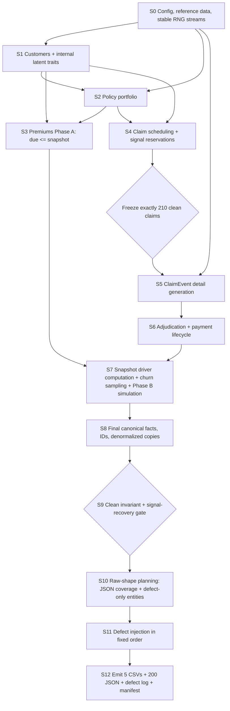

# Synthetic Data Generator Specification

*GMS Data Engineer Case Study. Version 0.1, September 24, 2026. Based on project overview v1.5 and source data dictionary v1.2.*

---

## 1. Purpose and scope

This document specifies **how the synthetic source data is generated**. It does not redefine the source schema. The source semantics are frozen in:

- `docs/project_overview.md` v1.5
- `docs/source_data_dictionary.md` v1.2
- `docs/source_data_dictionary.yaml` v1.2

The generator has four responsibilities:

1. create a coherent clean internal insurance portfolio;
2. embed the business patterns needed by the five analytics objectives;
3. prove the clean portfolio satisfies the frozen invariants and signal checks;
4. project that clean portfolio into deliberately messy raw source files and record every injected defect.

The generator must **not** use the defect log to influence pipeline behavior. `data/raw/_defect_log.csv` is evaluation-only.

No generator code is defined in this document.

---

## 2. Design principles

### 2.1 Generate business facts before source files

The generator does not create the five CSVs and JSON files independently. It first creates a coherent internal business state, then materializes different source-system views of that state.

A claim is represented internally as a canonical **ClaimEvent** containing the facts needed by both `Claim.csv`, `Claim_Payment.csv`, and the claim-detail JSON.

Conceptually:

```text
ClaimEvent
├── policy/customer ownership
├── claim type and service dates
├── provider
├── line items
├── submission timestamp/channel
├── documents
├── adjuster
├── claim amount
├── adjudication result
└── payment state
        │
        ├──> Claim.csv
        ├──> Claim_Payment.csv
        └──> JSON claim-detail file
```

This avoids making one emitted file artificially "cause" another emitted file.

### 2.2 Separate causal generation order from file emission order

Foreign-key parents must exist before children, but that is not sufficient to define the causal generation order.

Examples:

- claim line items determine `claim_amount`;
- line-item dates determine `service_date`;
- JSON-carried `submission_channel`, `documents_submitted`, and `adjuster_id` influence processing duration;
- adjudication determines `Claim.claim_status` and `approved_amount`.

Therefore the JSON **business content** is generated before adjudication even though physical JSON files are written only after the full clean portfolio is complete.

### 2.3 Simulate retention in two time phases

Retention is generated around the frozen snapshot date:

- **Phase A / observation:** through `2026-03-31`
- **Phase B / outcome:** `2026-04-01` through `2026-06-30`

All retention drivers are computed from Phase A only. Churn is sampled after those drivers exist. Phase B then realizes the future outcome.

This makes the no-leakage rule true by construction.

### 2.4 Distinguish business anomalies from injected data defects

Suspicious patterns such as F6 line-item/header mismatch are valid synthetic business signals. They are not automatically raw-data defects.

Example:

- **F6 business anomaly:** intentionally inconsistent claim header/detail retained as a suspicious feature;
- **DQ corruption:** a later raw-data defect changes an amount and is recorded in `_defect_log.csv`.

The clean invariant gate therefore treats documented signal exceptions separately from accidental/injected corruption.

### 2.5 Freeze clean entity populations before downstream calculations

The exact clean claim population must be finalized **before** claim-detail generation, deductible accumulation, adjudication, or payment generation.

The generator may not trim or top up claims after those calculations, because doing so could alter later policy-year deductible and approval calculations.

---

## 3. Exact versus emergent generation targets

### 3.1 Exact clean-base counts

These are generator contracts, not approximate goals:

| Item | Exact clean-base target |
|---|---:|
| Canonical customers | 150 |
| Canonical policies | 180 |
| Canonical claims | 210 |
| Physical JSON files after raw-shape planning | 200 |
| Master random seed | 20260923 |

The raw CSV row counts can be larger because defect-only records, duplicate-person records, duplicated rows, near-key duplicates, and orphan records are added later.

### 3.2 Emergent counts

These arise from the business simulation and are checked against expected ranges rather than forced after the fact:

- premium instalments: approximately 3,500;
- pending claims: approximately 15;
- retention-eligible customers: expected to be roughly 100–120;
- churned customers: expected to be roughly 12–18 at the default scale;
- policy/payment status mixes;
- counts of scheduled versus paid claims.

If an emergent value falls outside a documented QA tolerance, tune the relevant generator parameter and rerun. Do not mutate finalized records after downstream dependencies have been calculated.

### 3.3 Scale parameter

The submitted reference dataset uses the exact counts above.

A generator-level `scale` parameter may later multiply customer/policy/claim volumes for experimentation, but:

- the reference dataset remains `scale = 1`;
- ratios and signal prevalence parameters stay logically equivalent;
- exact fixed requirements such as the submitted 200 JSON files apply to the reference dataset only.

---

## 4. Reproducibility contract

Reproducibility is a first-class requirement.

Given the same:

- generator code version,
- configuration,
- master seed,
- Python/package environment,

the generator must produce the same clean business facts, selected signal carriers, defect locations, source rows, JSON files, and defect log.

### 4.1 Stable RNG streams

Use independent deterministic random-number streams for generator stages.

A preferred design is a stable stage identifier derived from the master seed, for example conceptually:

```text
customers        <- SeedSequence([20260923, 1])
policies         <- SeedSequence([20260923, 2])
premiums_phase_a <- SeedSequence([20260923, 3])
claim_schedule   <- SeedSequence([20260923, 4])
claim_details    <- SeedSequence([20260923, 5])
adjudication     <- SeedSequence([20260923, 6])
retention_phase_b<- SeedSequence([20260923, 7])
raw_shape        <- SeedSequence([20260923, 10])
defects          <- SeedSequence([20260923, 11])
```

The important property is that stage IDs are stable. Adding or changing random draws inside one stage must not reshuffle unrelated stages.

### 4.2 Deterministic ordering

Before any operation whose result depends on row order:

- sort records by a documented stable key;
- never depend on Python set iteration order or unspecified dictionary traversal;
- assign permanent IDs only after the relevant population has been frozen;
- use stable tie-breakers.

Examples:

- claims: order by `claim_date/submitted_at`, then internal temporary key;
- premiums: order by `policy_id`, `due_date`;
- defect log: order by injection stage, source, record key, field, then assign `defect_id`.

### 4.3 Deterministic money and FX arithmetic

Money calculations use an explicit decimal rounding rule rather than relying on binary floating-point behavior.

Rules:

- line-item money stored to two decimal places;
- quantity × unit amount rounded to two decimal places;
- travel line items remain in claim currency;
- convert the **claim total once** using `exchange_rate_to_cad`;
- round the CAD total to two decimals;
- deductible and approval calculations use the same explicit rounding convention.

The implementation should use a decimal representation with a fixed rounding mode.

### 4.4 Deterministic file emission

For byte-stable outputs:

- UTF-8 encoding;
- fixed newline convention;
- fixed CSV column order;
- fixed row order;
- fixed JSON field ordering;
- fixed numeric/date formatting;
- deterministic file names;
- no timestamps such as "generated now" inside the source files.

### 4.5 Generation manifest

The generator writes a small non-business QA manifest, for example `data/raw/_generation_manifest.json`, containing:

- master seed;
- scale;
- generator/spec version;
- source-dictionary version;
- code commit SHA when available;
- Python version;
- important package versions;
- exact clean-base counts;
- actual emitted row/file counts;
- SHA-256 hash for each generated raw file.

The pipeline must not use this manifest as an input.

The manifest allows a reviewer to verify that a rerun produced identical artifacts.

---

## 5. Dependency graph



---

## 6. Stage contracts

### S0 — Configuration, reference data, RNG streams

**Owns**

- generator parameters;
- plan catalogue;
- age bands;
- province reference data;
- claim-type reference data;
- FX assumptions;
- 80 providers;
- 12 adjusters;
- stable random-number streams.

Designate internally:

- 3–4 providers as high-concentration/"hot" providers for F5;
- 2–3 adjusters as slow adjusters for operational signals.

These internal designations are generator metadata, not emitted target labels.

---

### S1 — Customers

Generate the 150 canonical customers.

Owns:

- DOB;
- demographics;
- province/city/postal code;
- `customer_since`;
- internal latent behavior parameters such as payment reliability and claim propensity.

Latent behavior parameters are never emitted.

Duplicate-person raw records are not created here; they belong to S10/S11.

---

### S2 — Policy portfolio

Generate exactly 180 clean policies linked to canonical customers.

Owns:

- product/plan;
- coverage type;
- start date;
- policy term;
- coverage/deductible;
- internal premium frequency;
- pre-snapshot legitimate terminations;
- travel-policy term structure.

Reserve enough policy starts near the observation period to support:

- early-claim signal F1;
- short-tenure retention cases.

`premium_frequency` is decided here internally even though it is emitted in `Policy_Premium.csv`.

---

### S3 — Premiums, Phase A

Generate premium instalments due on or before the snapshot.

Owns:

- premium amount;
- age band at `due_date`;
- paid/late/missed behavior;
- Phase-A payment history.

Key rule:

> Early outcome-window lapses must be able to have a causal missed premium already observable before the snapshot.

Therefore S7 must not manufacture all lapse-driving missed premiums after churn is sampled.

INV16 is checked from the clean data:

```text
Policy_Premium.age_band
=
age_band(Customer.date_of_birth, Policy_Premium.due_date)
```

---

### S4 — Claim scheduling and signal reservation

Generate candidate claim slots from policy exposure, then reserve required signal patterns before ordinary claims are finalized.

Owns:

- claim frequency;
- product/claim type;
- service-date placement;
- repeat-claim clusters;
- early-claim slots;
- waiting-period attempts;
- travel-date anomaly eligibility;
- genuine large-outlier slots.

Then:

1. preserve all mandatory signal slots;
2. trim/top up only ordinary non-signal candidates;
3. freeze exactly **210 clean claims**.

No clean claim may be added or removed after this stage.

F9 restriction:

> A travel incident outside an individual trip window may be used only where the policy term legitimately extends beyond that trip window, such as a suitable multi-trip policy. Do not create F9 by placing service outside the policy term.

---

### S5 — ClaimEvent detail generation

Generate the common internal business facts used by Claim and JSON.

Owns:

- provider;
- health/dental/travel-specific details;
- line items;
- FX;
- submission timestamp;
- submission channel;
- required/submitted documents;
- adjuster assignment;
- claim amount.

Signal carriers generated here include:

- F3 near maximum;
- F5 provider concentration;
- F6 line-item/header mismatch;
- F7 missing documents;
- F8 weekend/unusual-hour submission.

#### F6 rule

F6 is an intentional business anomaly, not an injected DQ defect.

The clean validation gate therefore accepts either:

1. header/detail reconciliation within tolerance; or
2. a documented F6 carrier.

Later raw amount corruptions must not be injected onto F6 claims or the designated genuine outliers when doing so would make the intended truth unrecoverable.

---

### S6 — Adjudication and payment

Process claims chronologically per policy.

Owns:

- deductible/benefit accumulators;
- approved amount;
- decision outcome;
- processing start;
- decision date;
- payment date/state/method;
- denial reason.

Processing-time generation depends on upstream characteristics such as:

- claim type;
- province;
- submission channel;
- document completeness;
- slow-adjuster designation.

Censor against `2026-06-30`:

- claims not yet decided become pending;
- approved/partial claims decided but not yet disbursed may be scheduled;
- denied claims retain adjudication dates but have no payment transaction.

F2 waiting-period attempts are generally denied with `waiting_period`, while still remaining visible as suspicious attempts.

---

### S7 — Snapshot drivers, churn, and Phase B

At `2026-03-31`:

1. construct the eligible retention cohort;
2. compute drivers using Phase-A data only;
3. sample churn outcome from those drivers;
4. simulate `2026-04-01` through `2026-06-30`.

Eligible customer:

- at least one active health/dental policy on snapshot;
- travel-only customers excluded.

Churn outcome:

`churned = 1` only if every health/dental policy active at the snapshot lapses/cancels in the outcome window and no replacement health/dental policy begins by extract end.

Phase B owns:

- outcome-window lapse/cancel dates;
- replacement-policy negative cases;
- post-snapshot premium activity;
- any new missed premium needed for a later lapse;
- suppression of business events that would occur after a policy's newly assigned `end_date`.

Early-April lapse cases must generally be supported by a pre-snapshot missed premium from S3 rather than by retroactively creating a cause after the snapshot.

---

### S8 — Final canonical facts and IDs

The business populations are already fixed.

Owns:

- permanent ID assignment;
- final status as of extract end;
- denormalized source-copy fields;
- canonical ordering;
- count assertions.

S8 must **not** trim or top up claims.

---

### S9 — Clean invariant and signal-recovery gate

No raw defects may be injected until S9 passes.

#### Invariant gate

Check INV01–INV16 from the source dictionary, with documented signal-aware exceptions such as F6.

#### Signal-presence gate

Verify the intended carriers exist:

- F1–F9 counts/nonzero prevalence;
- genuine large outliers;
- slow operational segments;
- retention drivers;
- province/plan performance differences.

#### Signal-recovery gate

Presence alone is insufficient. Confirm the clean data allows downstream features to recover the intended relationship.

Examples:

- churners should have higher pre-snapshot late/missed-premium rates than non-churners;
- churners should have higher denied-claim prevalence than non-churners;
- designated slow segments should have higher queue/handling times;
- hot providers should be over-represented among claims carrying multiple suspicious traits;
- region/plan groups should show non-identical approved-claims-to-premium patterns.

These are QA checks, not labels added to the raw data.

---

### S10 — Raw-shape planning

Plan physical source coverage and defect-only records without mutating the clean business truth.

Owns:

- which real claims receive JSON;
- 14 claims with no JSON file;
- 2 malformed JSON files belonging to real claims;
- 4 orphan JSON files;
- 3 invalid QC/NB/NU customer records and their deliberate relationships;
- 4 duplicate-person rows.

Duplicate-person rule:

> At least 2 of the 4 duplicate-person identities should participate in relationships so entity resolution has consequences beyond deleting a cosmetic duplicate.

These cases must not be confused with independently injected `XF_OWNER_CONFLICT` cases.

For the invalid QC/NB/NU records, the generator specification will use:

- one invalid customer per unserved province;
- one policy per invalid customer;
- premium rows for those policies where applicable;
- no normal clean claims for those invalid policies unless a future explicit test case requires them.

---

### S11 — Defect injection

Inject defects only after the clean invariant/signal gate passes.

Use a fixed injection order so reproducibility and defect semantics stay clear:

1. defect-only entity insertions / raw-shape additions;
2. cross-file conflicts;
3. invalid values and erroneous missing values;
4. orphan foreign keys;
5. format and type corruption in the documented dirty pools;
6. JSON key/type/shape drift;
7. exact/near duplicates **last**, so a duplicate reproduces the already-formed raw row intended by the test case.

Rules:

- every injected defect is logged;
- no signal is written to the defect log merely because it is suspicious;
- avoid stacking incompatible defects on the same field;
- avoid injecting recovery-destroying defects onto F6 carriers and genuine outliers;
- use the dedicated S11 RNG stream only.

---

### S12 — File emission

Emit:

- `Customer.csv`
- `Policy.csv`
- `Claim.csv`
- `Claim_Payment.csv`
- `Policy_Premium.csv`
- exactly 200 files under `data/raw/json/`
- `data/raw/_defect_log.csv`
- `data/raw/_generation_manifest.json`

The physical raw files are the only inputs intended for the later data pipeline. The defect log and generation manifest are evaluation/QA artifacts and must not be read by the pipeline.

---

## 7. Resolved generator-specific ambiguities

| Issue | Resolution |
|---|---|
| F6 versus JSON reconciliation | F6 is a documented business anomaly. Clean reconciliation requires equality **or** an explicit F6 carrier. Later DQ amount corruption is separate. |
| F9 versus policy date invariant | F9 may violate an individual trip window only where the broader policy term still covers the service/incident date. |
| Early outcome-window lapse causality | Early lapses should normally be supported by a Phase-A missed premium already visible at snapshot. Later lapses may acquire new Phase-B missed instalments. |
| Exact claim count | Candidate claims are reconciled to exactly 210 in S4, before details/adjudication. Never trim claims in S8. |
| JSON-before-Claim dependency | Generate one internal ClaimEvent. Claim CSV, payment CSV and JSON are projections emitted later. |
| Duplicate-person usefulness | At least two duplicate identities participate in policy relationships so canonical merge/re-keying is meaningful. |
| Exact vs approximate volumes | Customer/policy/claim base counts and 200 JSON files are exact; premiums, pending count and churn count are emergent with QA tolerances. |
| FX rounding | Round line items in source currency, convert the aggregate claim total once, then round CAD to 2 decimals. |
| F2 waiting-period attempt | Usually denied with `waiting_period`; the attempted claim remains a signal without requiring a fraud label. |
| Small churn class | Accepted for the reference assessment dataset; use `scale` for larger experimental runs. |

---

## 8. What remains to specify before coding

The architecture and causal order above are frozen for the generator.

The next revision should define the remaining numeric/calibration details:

- probability distributions and parameter ranges;
- exact signal prevalence targets/tolerances;
- churn sampling function and target range;
- processing-time multipliers;
- claim severity parameters;
- policy-start/term distributions;
- exact raw defect counts/rates and overlap restrictions;
- QA threshold table.

Those values may be calibrated during clean-data QA, but they must not alter the frozen source semantics or the causal stage structure above.
