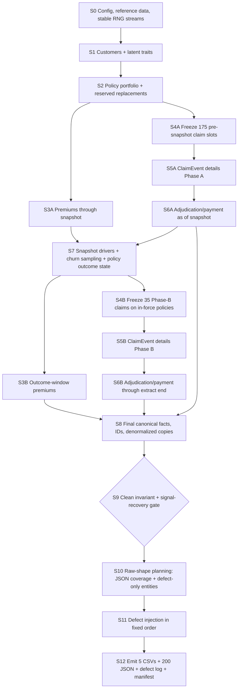

# Synthetic Data Generator Specification

*GMS Data Engineer Case Study. Version 0.2, September 24, 2026. Based on project overview v1.5 and source data dictionary v1.2.*

---

## 1. Purpose and scope

This document specifies **how the synthetic source data is generated**. It does not redefine the source schema. The source semantics are frozen in:

- `docs/project_overview.md` v1.5
- `docs/source_data_dictionary.md` v1.2
- `docs/source_data_dictionary.yaml` v1.2

The generator has four responsibilities:

1. create a coherent clean internal insurance portfolio;
2. embed the business patterns needed by the five analytics objectives;
3. prove the clean portfolio satisfies the frozen invariants and signal checks;
4. project that clean portfolio into deliberately messy raw source files and record every injected defect.

The generator must **not** use the defect log to influence pipeline behavior. `data/raw/_defect_log.csv` is evaluation-only.

No generator code is defined in this document.

---

## 2. Design principles

### 2.1 Generate business facts before source files

The generator does not create the five CSVs and JSON files independently. It first creates a coherent internal business state, then materializes different source-system views of that state.

A claim is represented internally as a canonical **ClaimEvent** containing the facts needed by both `Claim.csv`, `Claim_Payment.csv`, and the claim-detail JSON.

Conceptually:

```text
ClaimEvent
├── policy/customer ownership
├── claim type and service dates
├── provider
├── line items
├── submission timestamp/channel
├── documents
├── adjuster
├── claim amount
├── adjudication result
└── payment state
        │
        ├──> Claim.csv
        ├──> Claim_Payment.csv
        └──> JSON claim-detail file
```

This avoids making one emitted file artificially "cause" another emitted file.

### 2.2 Separate causal generation order from file emission order

Foreign-key parents must exist before children, but that is not sufficient to define the causal generation order.

Examples:

- claim line items determine `claim_amount`;
- line-item dates determine `service_date`;
- JSON-carried `submission_channel`, `documents_submitted`, and `adjuster_id` influence processing duration;
- adjudication determines `Claim.claim_status` and `approved_amount`.

Therefore the JSON **business content** is generated before adjudication even though physical JSON files are written only after the full clean portfolio is complete.

### 2.3 Simulate retention in two time phases

Retention is generated around the frozen snapshot date:

- **Phase A / observation:** through `2026-03-31`
- **Phase B / outcome:** `2026-04-01` through `2026-06-30`

All retention drivers are computed from Phase A only. Churn is sampled after those drivers exist. Phase B then realizes the future outcome.

This makes the no-leakage rule true by construction.

### 2.4 Distinguish business anomalies from injected data defects

Suspicious patterns such as F6 line-item/header mismatch are valid synthetic business signals. They are not automatically raw-data defects.

Example:

- **F6 business anomaly:** intentionally inconsistent claim header/detail retained as a suspicious feature;
- **DQ corruption:** a later raw-data defect changes an amount and is recorded in `_defect_log.csv`.

The clean invariant gate therefore treats documented signal exceptions separately from accidental/injected corruption.

### 2.5 Freeze each time phase before downstream calculations

The generator is time-split for retention. Claim populations are therefore frozen **per phase** before claim-detail generation, deductible accumulation, adjudication, or payment generation.

For the reference dataset:

- 175 clean claims are frozen for history through the snapshot;
- after churn/policy outcome state is known, 35 clean outcome-window claims are frozen only among policies that are actually in force;
- together they produce exactly 210 canonical claims.

The generator may not trim or top up a phase after its downstream calculations have begun, because doing so could alter policy-year deductible and approval calculations.

---

## 3. Exact versus emergent generation targets

### 3.1 Exact clean-base counts

These are generator contracts, not approximate goals:

| Item | Exact clean-base target |
|---|---:|
| Canonical customers | 150 |
| Canonical policies | 180 |
| Canonical claims | 210 |
| Physical JSON files after raw-shape planning | 200 |
| Master random seed | 20260923 |

The raw CSV row counts can be larger because defect-only records, duplicate-person records, duplicated rows, near-key duplicates, and orphan records are added later.

### 3.2 Emergent counts

These arise from the business simulation and are checked against expected ranges rather than forced after the fact:

- premium instalments: expected range 3,000–4,000, target about 3,500;
- pending claims at extract end: expected range 10–16;
- retention-eligible customers: expected range 100–120;
- churned customers: expected range 12–18 at the default scale;
- policy/payment status mixes;
- counts of scheduled versus paid claims.

If an emergent value falls outside a documented QA tolerance, tune the relevant generator parameter and rerun. Do not mutate finalized records after downstream dependencies have been calculated.

### 3.3 Scale parameter

The submitted reference dataset uses the exact counts above.

A generator-level `scale` parameter may later multiply customer/policy/claim volumes for experimentation, but:

- the reference dataset remains `scale = 1`;
- ratios and signal prevalence parameters stay logically equivalent;
- exact fixed requirements such as the submitted 200 JSON files apply to the reference dataset only.

---

## 4. Reproducibility contract

Reproducibility is a first-class requirement.

Given the same:

- generator code version,
- configuration,
- master seed,
- Python/package environment,

the generator must produce the same clean business facts, selected signal carriers, defect locations, source rows, JSON files, and defect log.

### 4.1 Stable RNG streams

Use independent deterministic random-number streams for generator stages.

A preferred design is a stable stage identifier derived from the master seed, for example conceptually:

```text
customers        <- SeedSequence([20260923, 1])
policies         <- SeedSequence([20260923, 2])
premiums_phase_a <- SeedSequence([20260923, 3])
claim_schedule   <- SeedSequence([20260923, 4])
claim_details    <- SeedSequence([20260923, 5])
adjudication     <- SeedSequence([20260923, 6])
retention_phase_b<- SeedSequence([20260923, 7])
raw_shape        <- SeedSequence([20260923, 10])
defects          <- SeedSequence([20260923, 11])
```

The important property is that stage IDs are stable. Adding or changing random draws inside one stage must not reshuffle unrelated stages.

### 4.2 Deterministic ordering

Before any operation whose result depends on row order:

- sort records by a documented stable key;
- never depend on Python set iteration order or unspecified dictionary traversal;
- assign permanent IDs only after the relevant population has been frozen;
- use stable tie-breakers.

Examples:

- claims: order by `claim_date/submitted_at`, then internal temporary key;
- premiums: order by `policy_id`, `due_date`;
- defect log: order by injection stage, source, record key, field, then assign `defect_id`.

### 4.3 Deterministic money and FX arithmetic

Money calculations use an explicit decimal rounding rule rather than relying on binary floating-point behavior.

Rules:

- line-item money stored to two decimal places;
- quantity × unit amount rounded to two decimal places;
- travel line items remain in claim currency;
- convert the **claim total once** using `exchange_rate_to_cad`;
- round the CAD total to two decimals;
- deductible and approval calculations use the same explicit rounding convention.

The implementation should use a decimal representation with a fixed rounding mode.

### 4.4 Deterministic file emission

For byte-stable outputs:

- UTF-8 encoding;
- fixed newline convention;
- fixed CSV column order;
- fixed row order;
- fixed JSON field ordering;
- fixed numeric/date formatting;
- deterministic file names;
- no timestamps such as "generated now" inside the source files.

### 4.5 Generation manifest

The generator writes a small non-business QA manifest, for example `data/raw/_generation_manifest.json`, containing:

- master seed;
- scale;
- generator/spec version;
- source-dictionary version;
- code commit SHA when available;
- Python version;
- important package versions;
- exact clean-base counts;
- actual emitted row/file counts;
- SHA-256 hash for each generated raw file.

The pipeline must not use this manifest as an input.

The manifest allows a reviewer to verify that a rerun produced identical artifacts.

---

## 5. Dependency graph



---

## 6. Stage contracts

### S0 — Configuration, reference data, RNG streams

**Owns**

- generator parameters;
- plan catalogue;
- age bands;
- province reference data;
- claim-type reference data;
- FX assumptions;
- 80 providers;
- 12 adjusters;
- stable random-number streams.

Designate internally:

- 3–4 providers as high-concentration/"hot" providers for F5;
- 2–3 adjusters as slow adjusters for operational signals.

These internal designations are generator metadata, not emitted target labels.

---

### S1 — Customers

Generate the 150 canonical customers.

Owns:

- DOB;
- demographics;
- province/city/postal code;
- `customer_since`;
- internal latent behavior parameters such as payment reliability and claim propensity.

Latent behavior parameters are never emitted.

Duplicate-person raw records are not created here; they belong to S10/S11.

---

### S2 — Policy portfolio

Generate exactly 180 clean policy records linked to canonical customers.

Owns:

- product/plan;
- coverage type;
- start date;
- policy term;
- coverage/deductible;
- internal premium frequency;
- pre-snapshot legitimate terminations;
- travel-policy term structure.

Four of the 180 health/dental policies are future-dated replacement policies starting in the outcome window. Their customers are deliberate policy-termination-but-not-customer-churn cases. These future records are never used as predictive retention features.

Reserve enough policy starts near the observation period to support:

- early-claim signal F1;
- short-tenure retention cases.

`premium_frequency` is decided here internally even though it is emitted in `Policy_Premium.csv`.

---

### S3A — Premiums through the snapshot

Generate premium instalments due on or before `2026-03-31`.

Owns:

- premium amount;
- age band at `due_date`;
- paid/late/missed behavior;
- observation-period payment history.

Key rule:

> Early outcome-window lapses must be able to have a causal missed premium already observable before the snapshot.

INV16 is checked from the clean data:

```text
Policy_Premium.age_band
=
age_band(Customer.date_of_birth, Policy_Premium.due_date)
```

---

### S4A — Pre-snapshot claim scheduling and signal reservation

Generate claim slots from policy exposure through the snapshot.

Reserve mandatory Phase-A signal carriers first, then fill ordinary claims using exposure/propensity weights. Freeze exactly **175** claims before detail generation.

Owns:

- claim frequency;
- product/claim type;
- service-date placement;
- repeat-claim clusters;
- early-claim slots;
- waiting-period attempts;
- eligible travel-date anomaly slots;
- genuine large-outlier slots.

---

### S5A / S6A — Phase-A details, adjudication, and payment state

Generate ClaimEvent details for the 175 frozen Phase-A claims, then process them chronologically per policy up to the snapshot.

These stages own the same detail/adjudication fields described below for Phase B. They provide the actual claim and denial history used by the retention risk calculation.

---

### S7 — Snapshot drivers, churn, and policy outcome state

At `2026-03-31`:

1. construct the eligible retention cohort;
2. compute drivers from Phase-A premiums/claims only;
3. sample churn from the calibrated risk function;
4. assign outcome-window lapse/cancel dates;
5. activate the four pre-reserved replacement-policy cases;
6. determine which policies remain in force for Phase-B premium and claim generation.

Eligible customer:

- at least one active health/dental policy on snapshot;
- travel-only customers excluded.

Churn outcome:

`churned = 1` only if every health/dental policy active at the snapshot lapses/cancels in the outcome window and no replacement health/dental policy begins by extract end.

Early-April lapse cases must normally have a missed premium already visible before the snapshot. A later lapse may be caused by a new Phase-B missed instalment. Cancelled policies do not require a missed premium.

---

### S3B — Outcome-window premiums

Generate premiums due from `2026-04-01` through `2026-06-30` only while the policy is in force.

For selected later lapse cases, generate the missed instalment first and place the lapse 30–60 days later, while still satisfying the extract-end boundary.

---

### S4B — Outcome-window claim scheduling

Generate claims only on policies that are actually in force after S7.

Freeze exactly **35** Phase-B claims. Together with the 175 Phase-A claims this gives exactly 210 canonical claims.

A travel incident outside an individual trip window may be used for F9 only where the broader policy term still covers the service/incident date. Do not create F9 by placing service outside the policy term.

---

### S5B — ClaimEvent detail generation

Generate the common internal business facts used by Claim and JSON:

- provider;
- health/dental/travel-specific details;
- line items;
- FX;
- submission timestamp;
- submission channel;
- required/submitted documents;
- adjuster assignment;
- claim amount.

Signal carriers generated here (and, where scheduled, in Phase A) include F3, F5, F6, F7 and F8.

#### F6 rule

F6 is an intentional business anomaly, not an injected DQ defect. Clean validation accepts either:

1. header/detail reconciliation within tolerance; or
2. a documented F6 carrier.

Later raw amount corruptions must not be injected onto F6 claims or the designated genuine outliers when doing so would make the intended truth unrecoverable.

---

### S6B — Adjudication and payment through extract end

Process Phase-B claims chronologically per policy.

Owns:

- deductible/benefit accumulators continued from Phase A;
- approved amount;
- decision outcome;
- processing start;
- decision date;
- payment date/state/method;
- denial reason.

Processing-time generation depends on claim type, province, submission channel, document completeness and slow-adjuster designation.

Censor against `2026-06-30`:

- claims not yet decided become pending;
- approved/partial claims decided but not yet disbursed may be scheduled;
- denied claims retain adjudication dates but have no payment transaction.

F2 waiting-period attempts are usually denied with `waiting_period`, while still remaining visible as suspicious attempts.

---

### S8 — Final canonical facts and IDs

The business populations are already fixed.

Owns:

- permanent ID assignment;
- final status as of extract end;
- denormalized source-copy fields;
- canonical ordering;
- exact count assertions.

S8 must **not** trim or top up claims or policies.

---

### S9 — Clean invariant and signal-recovery gate

No raw defects may be injected until S9 passes.

#### Invariant gate

Check INV01–INV16 from the source dictionary, with documented signal-aware exceptions such as F6.

#### Signal-presence gate

Verify the intended carriers exist:

- F1–F9 counts/nonzero prevalence;
- genuine large outliers;
- slow operational segments;
- retention drivers;
- province/plan performance differences.

#### Signal-recovery gate

Presence alone is insufficient. Confirm the clean data allows downstream features to recover the intended relationship.

Examples:

- churners should have higher pre-snapshot late/missed-premium rates than non-churners;
- churners should have higher denied-claim prevalence than non-churners;
- designated slow segments should have higher queue/handling times;
- hot providers should be over-represented among claims carrying multiple suspicious traits;
- region/plan groups should show non-identical approved-claims-to-premium patterns.

These are QA checks, not labels added to the raw data.

---

### S10 — Raw-shape planning

Plan physical source coverage and defect-only records without mutating the clean business truth.

Owns:

- which real claims receive JSON;
- 14 claims with no JSON file;
- 2 malformed JSON files belonging to real claims;
- 4 orphan JSON files;
- 3 invalid QC/NB/NU customer records and their deliberate relationships;
- 4 duplicate-person rows.

Duplicate-person rule:

> At least 2 of the 4 duplicate-person identities should participate in relationships so entity resolution has consequences beyond deleting a cosmetic duplicate.

These cases must not be confused with independently injected `XF_OWNER_CONFLICT` cases.

For the invalid QC/NB/NU records, the generator specification will use:

- one invalid customer per unserved province;
- one policy per invalid customer;
- premium rows for those policies where applicable;
- no normal clean claims for those invalid policies unless a future explicit test case requires them.

---

### S11 — Defect injection

Inject defects only after the clean invariant/signal gate passes.

Use a fixed injection order so reproducibility and defect semantics stay clear:

1. defect-only entity insertions / raw-shape additions;
2. cross-file conflicts;
3. invalid values and erroneous missing values;
4. orphan foreign keys;
5. format and type corruption in the documented dirty pools;
6. JSON key/type/shape drift;
7. exact/near duplicates **last**, so a duplicate reproduces the already-formed raw row intended by the test case.

Rules:

- every injected defect is logged;
- no signal is written to the defect log merely because it is suspicious;
- avoid stacking incompatible defects on the same field;
- avoid injecting recovery-destroying defects onto F6 carriers and genuine outliers;
- use the dedicated S11 RNG stream only.

---

### S12 — File emission

Emit:

- `Customer.csv`
- `Policy.csv`
- `Claim.csv`
- `Claim_Payment.csv`
- `Policy_Premium.csv`
- exactly 200 files under `data/raw/json/`
- `data/raw/_defect_log.csv`
- `data/raw/_generation_manifest.json`

The physical raw files are the only inputs intended for the later data pipeline. The defect log and generation manifest are evaluation/QA artifacts and must not be read by the pipeline.

---

## 7. Resolved generator-specific ambiguities

| Issue | Resolution |
|---|---|
| F6 versus JSON reconciliation | F6 is a documented business anomaly. Clean reconciliation requires equality **or** an explicit F6 carrier. Later DQ amount corruption is separate. |
| F9 versus policy date invariant | F9 may violate an individual trip window only where the broader policy term still covers the service/incident date. |
| Early outcome-window lapse causality | Early lapses should normally be supported by a Phase-A missed premium already visible at snapshot. Later lapses may acquire new Phase-B missed instalments. |
| Exact claim count | Freeze 175 Phase-A claims before Phase-A details and 35 Phase-B claims after churn/policy outcome state is known. Never trim claims in S8. |
| JSON-before-Claim dependency | Generate one internal ClaimEvent. Claim CSV, payment CSV and JSON are projections emitted later. |
| Duplicate-person usefulness | At least two duplicate identities participate in policy relationships so canonical merge/re-keying is meaningful. |
| Exact vs approximate volumes | Customer/policy/claim base counts and 200 JSON files are exact; premiums, pending count and churn count are emergent with QA tolerances. |
| FX rounding | Round line items in source currency, convert the aggregate claim total once, then round CAD to 2 decimals. |
| F2 waiting-period attempt | Usually denied with `waiting_period`; the attempted claim remains a signal without requiring a fraud label. |
| Small churn class | Accepted for the reference assessment dataset; use `scale` for larger experimental runs. |

---

## 8. Frozen calibration profile for the reference dataset

These values define the first implementation target. They are **synthetic modelling assumptions**, not GMS internal parameters. If QA exposes an issue, tune only the smallest relevant parameter and rerun from the same master seed; do not hand-edit generated records.

### 8.1 Portfolio composition

#### Customers

Use the frozen province weights from the source dictionary.

Assign two independent internal latent classes:

| Latent class | Reference mix |
|---|---:|
| Payment reliability: good / mixed / poor | 70% / 25% / 5% |
| Claim propensity: low / normal / high | 35% / 50% / 15% |

For 150 customers, deterministic quota allocation should produce approximately 105/38/7 payment-reliability classes and 53/75/22 claim-propensity classes before seeded shuffling.

#### Policies

Exact product counts:

| Product | Policies |
|---|---:|
| Health | 99 |
| Dental | 54 |
| Travel | 27 |
| **Total** | **180** |

Plan targets:

| Plan | Count |
|---|---:|
| BasicPlan | 30 |
| ExtendaPlan | 30 |
| OmniPlan | 24 |
| Replacement Health | 15 |
| Dental Basic | 32 |
| Dental Plus | 22 |
| TravelStar | 16 |
| StudentPlan | 11 |

Health/dental premium frequency, subject to each plan's allowed values:

- monthly: 70%;
- quarterly: 20%;
- yearly: 10%.

TravelStar is `single`. StudentPlan uses monthly/yearly at 70%/30%.

Health/dental start-date calibration:

- 65% before the retention observation window;
- 30% during `2025-04-01..2026-03-31`;
- 5% in the outcome window.

Exactly four outcome-window health/dental policies are designated replacement cases for customers whose old policy terminates but whose customer-level churn label must remain 0.

Travel calibration:

- TravelStar term: 7–45 days;
- StudentPlan term: 365 days;
- F9 carriers are restricted to eligible StudentPlan/annual-term situations where the incident can be outside an individual trip but still inside the policy term.

### 8.2 Premium-payment behavior

Per-instalment status probabilities by the customer's internal payment-reliability class:

| Reliability | Paid on time | Late | Missed |
|---|---:|---:|---:|
| Good | 0.96 | 0.04 | 0.00 |
| Mixed | 0.82 | 0.14 | 0.04 |
| Poor | 0.55 | 0.25 | 0.20 |

A `missed` status is allowed only when the due date is at least 30 days before the relevant as-of/extract date.

Late-payment delay:

- mixed: 3–20 days;
- poor: 5–35 days.

The existing premium formula, age-band factors, and coverage-type factors remain authoritative from the source dictionary.

### 8.3 Claim-count and product calibration

Exact phase totals:

| Phase | Claims |
|---|---:|
| Through snapshot | 175 |
| Outcome window | 35 |
| **Total** | **210** |

Exact overall product targets:

| Product | Claims |
|---|---:|
| Health | 116 |
| Dental | 63 |
| Travel | 31 |

Use phase quotas of approximately:

- Phase A: 96 health, 52 dental, 27 travel;
- Phase B: 20 health, 11 dental, 4 travel.

Exact claim-type targets for the reference run:

**Health (116)**

- prescription drugs: 41;
- health practitioner: 41;
- vision: 14;
- hearing aids: 3;
- medical equipment: 8;
- ambulance: 5;
- hospital cash: 4.

**Dental (63)**

- preventive: 35;
- basic: 22;
- major: 6.

**Travel (31)**

- emergency medical: 14;
- trip cancellation: 8;
- trip interruption: 3;
- baggage: 6.

Within those quotas, choose policies using exposure-weighted claim propensity.

Synthetic frequency multipliers:

**Age**

| Age band | Multiplier |
|---|---:|
| Under 35 | 0.80 |
| 35–44 | 0.90 |
| 45–54 | 1.00 |
| 55–64 | 1.15 |
| 65–74 | 1.30 |
| 75+ | 1.40 |

**Province**

| Province group | Multiplier |
|---|---:|
| SK | 1.00 |
| AB | 1.05 |
| MB | 0.95 |
| ON | 1.10 |
| BC | 1.15 |
| NS/PE/NL/YT/NT | 1.00 |

**Plan**

| Plan | Multiplier |
|---|---:|
| BasicPlan | 0.90 |
| ExtendaPlan | 1.00 |
| OmniPlan | 1.15 |
| Replacement Health | 1.20 |
| Dental Basic | 0.90 |
| Dental Plus | 1.10 |

Travel frequency is primarily term/exposure driven rather than using the health/dental plan multipliers.

### 8.4 Claim severity and money rules

Use the claim-type lognormal parameters already frozen in the source dictionary.

For ordinary non-signal claims:

- minimum generated header amount: CAD 20;
- avoid intentionally placing an ordinary claim above 80% of the applicable benefit/sub-limit;
- travel emergency-medical claims are not eligible for F3 against the multi-million-dollar emergency coverage limit.

F3 near-maximum carriers:

- target 90–98% of the applicable maximum;
- apply to health/dental annual benefit context or realistic travel cancellation/interruption/baggage sub-limits.

F6 line-item mismatch:

- exactly 5 reserved carriers;
- header `claim_amount` is 10–35% above the reconciled line-item amount;
- this is a business anomaly, not a defect-log item.

Genuine large legitimate outliers:

- exactly 3 travel emergency-medical claims;
- target CAD values around 25,000, 55,000 and 85,000;
- JSON and Claim agree for these claims.

Money uses the reproducibility rules in §4: decimal arithmetic, fixed rounding, travel total converted once.

### 8.5 Suspicious-pattern carrier targets

These are **reserved carrier counts**, not fraud labels. Ordinary generation may naturally create additional claims that satisfy the same derived rule.

| Trait | Reserved target |
|---|---:|
| F1 early claim | 12 claims |
| F2 dental waiting-period attempt | 6 claims |
| F3 near applicable maximum | 8 claims |
| F4 repeat claims | 4 customer clusters × 3 claims |
| F5 provider concentration | 4 hot providers; 24 routed claims |
| F6 line-item mismatch | 5 claims |
| F7 missing required documents | 10 claims |
| F8 weekend / 00:00–05:00 submission | 12 claims |
| F9 trip-window anomaly within valid broader policy term | 4 claims |
| Genuine large legitimate outlier | 3 claims |

F5 calibration:

- at least 12 of the 24 hot-provider claims must also carry another suspicious trait;
- provider type must remain compatible with claim type;
- hot-provider designation is internal generator metadata only.

Allow controlled overlap so approximately 10–18 claims carry two or more suspicious traits. Do not deliberately make every carrier overlap.

F2 calibration:

- 5 of the 6 reserved waiting-period attempts are denied with `waiting_period`;
- 1 may be partially approved to avoid making the rule perfectly deterministic.

### 8.6 Adjudication calibration

For non-F2 claims that reach a decision, use these initial target shares before business constraints:

- approved: 72%;
- partially approved: 18%;
- denied: 10%.

Business rules override these shares when required.

Payment/approval amount logic:

- denied: `approved_amount = 0`;
- otherwise apply remaining deductible first;
- cap against remaining applicable benefit;
- reference generator co-insurance factor = 1.00 unless later explicitly configured;
- if a benefit/deductible constraint reduces the payable amount materially, classify as partially approved;
- otherwise classify as approved.

Claims are processed chronologically per policy so deductible and benefit-year accumulators are reproducible.

### 8.7 Operational timing calibration

Base durations in calendar days:

- queue time: Gamma(shape=2.0, scale=0.75), mean 1.5;
- handling time: Gamma(shape=2.5, scale=1.20), mean 3.0.

Apply synthetic slow-segment multipliers:

| Condition | Component | Multiplier |
|---|---|---:|
| Province outside SK | queue | 1.15 |
| Mail submission | queue | 1.75 |
| Travel claim | handling | 1.50 |
| Missing required documents | handling | 1.60 |
| Designated slow adjuster | handling | 1.80 |

Cap the total multiplier for either component at 3.0.

Payment lag after decision:

- provider direct: 0–2 days;
- direct deposit: 1–3 days;
- cheque: 3–7 days.

To make extract-end censoring visible, reserve 16 Phase-B submissions in `2026-06-22..2026-06-30`. Normal queue/handling draws then determine which become pending. QA target: 10–16 pending claims at extract end.

### 8.8 Retention/churn calibration

Eligible population remains exactly as defined in the source dictionary.

For each eligible customer compute the Phase-A risk score:

```text
z =
  -2.40
  + 1.40 * had_missed_premium_last_90d
  + 0.60 * had_2plus_late_premiums_12m
  + 0.80 * had_denied_claim_12m
  + 0.50 * tenure_under_365d
  + 0.35 * age_band_increase_12m

p_churn = sigmoid(z)
p_churn = clamp(p_churn, 0.03, 0.70)
```

Draw churn with the retention RNG stream.

Reference-run QA target:

- eligible customers: 100–120;
- churned customers: 12–18.

If churn count is outside the target, tune **only the intercept** and rerun from the same master seed. Do not hand-select churners.

Outcome realization:

- target about 70% of churn outcomes as `lapsed`, 30% as `cancelled`;
- a lapsed policy must satisfy INV12;
- if a churner already has a missed premium in the pre-snapshot 90-day lookback, an early-April/May lapse may use it;
- otherwise generate a Phase-B missed premium and place lapse 30–60 days later;
- the four reserved replacement-policy cases are forced customer-level non-churn outcomes despite old-policy termination.

### 8.9 Defect calibration and overlap restrictions

The exact defect counts/rates in `source_data_dictionary.yaml` remain authoritative.

Dirty-row pools:

| Source | Pool |
|---|---:|
| Customer | 10% |
| Policy | 10% |
| Claim | 8% |
| Claim Payment | 8% |
| Policy Premium | 5% |
| Parseable matched JSON | 10% |

Additional overlap rules:

1. `JSON_MALFORMED`, `JSON_MISSING_FILE`, and `JSON_ORPHAN` are mutually exclusive physical-file cases.
2. A missing value and a formatting/type defect may not target the same field.
3. `ORPHAN_FK` and an owner/status cross-file conflict may not target the same relationship.
4. `XF_PAYMENT_AMOUNT` is applied only to approved/partially-approved decided claims.
5. F6 carriers and the three genuine outliers cannot receive `OUT_ERROR`, negative-amount corruption, or missing header/detail amount corruption.
6. Exact duplicates are created last and are not subsequently mutated.
7. Duplicate-person test cases are distinct from `XF_OWNER_CONFLICT` cases.
8. Signal traits are never written to the defect log unless an independent raw-data defect is also injected.
9. Overall affected raw records/files should remain within the overview target of 5–15%.

### 8.10 Clean-data QA thresholds

The generator does not proceed to S10/S11 until all hard gates pass.

#### Hard gates

- 150 canonical customers;
- 180 canonical policies;
- 175 Phase-A + 35 Phase-B = 210 canonical claims;
- all canonical primary keys unique;
- INV01–INV16 pass, except explicitly documented F6 signal exceptions;
- every lapsed policy satisfies INV12;
- exactly 4 reserved replacement-policy negative cases;
- no source fraud target exists;
- all monetary/date ordering rules pass.

#### Signal gates

- each reserved F1–F9 carrier target is present;
- exactly 3 genuine large legitimate outliers are present;
- 10–18 claims carry two or more suspicious traits;
- hot-provider claims carrying another suspicious trait are at least 2× as common proportionally as for non-hot providers.

#### Retention recovery gates

Among eligible customers:

- churners' pre-snapshot late-or-missed-premium rate >= 1.5 × non-churners' rate;
- churners' denied-claim prevalence >= 1.25 × non-churners' prevalence;
- eligible count 100–120;
- churn count 12–18.

#### Operations recovery gates

- median queue time for mail >= 1.25 × online/mobile median;
- median handling time for travel >= 1.20 × non-travel median;
- median handling time for designated slow adjusters >= 1.25 × other-adjuster median;
- pending claims at extract end: 10–16.

#### Policy/region recovery gates

For groups with adequate exposure:

- at least three plan groups have non-zero claims and premiums;
- among plan groups with >= 12 policy-months, max/min approved-claims-to-premium-due ratio >= 1.20;
- at least five served provinces have at least one claim.

### 8.11 Raw-output QA thresholds

After S11/S12:

- exactly 200 physical JSON files;
- composition target: 194 parseable matched files + 2 malformed real-claim files + 4 orphan files;
- 14 canonical claims have no JSON file;
- every injected defect has exactly one defect-log entry per affected field/record as defined by the log contract;
- count-based defect targets equal the source dictionary;
- raw affected-record/file share remains 5–15%;
- rerunning with the same code/config/seed produces identical file hashes in `_generation_manifest.json`.

With this section frozen, generator implementation should translate the stage contracts and parameters into code rather than inventing additional business rules during coding.
